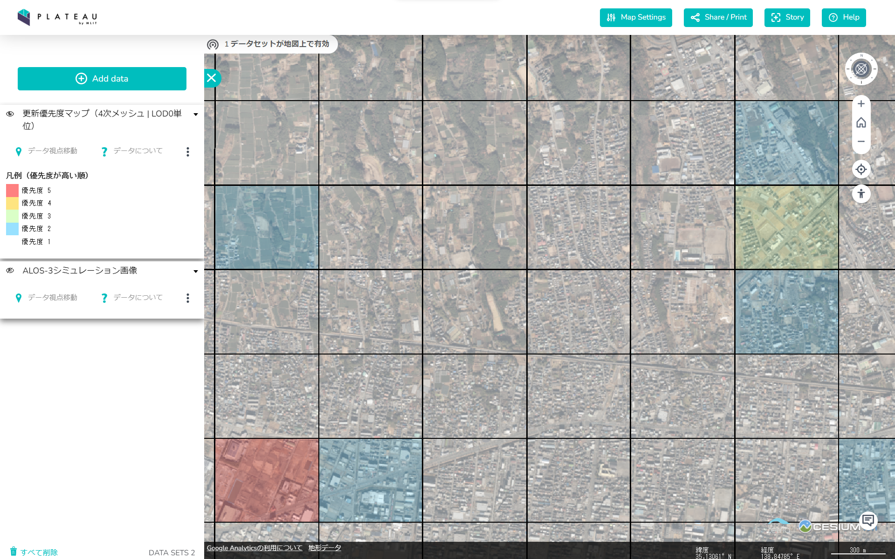

# FY2022 Project PLATEAU UC22-007「3D都市モデルの更新優先度マップ」の成果物のマニュアル
航空写真（オルソ画像）と光学衛星画像を用いて、都市内の建築物の変化箇所を検出し、変化率を更新優先度マップとしてメッシュ単位で出力するウェブシステムです。  

 

# [旧時期（2017年撮影 航空写真）](#tab/old)

# [新時期（2019年撮影 ALOS-3衛星シミュレーション画像）](#tab/new)

---

## ユースケースの概要
3D都市モデルの整備に利用した航空写真と撮影頻度が高い衛星画像を比較し、建物等の新築・滅失等の変化を抽出するAIモデルを開発しました。
これにより、3D都市モデルと現実空間の差分を低コストで迅速に可視化し、自治体による能動的・継続的な運用と民間領域での利活用による3D都市モデルのエコシステム活性化を目指します。 

## 開発システムの概要
航空写真（オルソ画像）と光学衛星画像を用いて、都市内の建築物の変化箇所を検出し、変化率を更新優先度マップとしてメッシュ単位で出力するウェブシステムです。  

GitHubリポジトリにて、以下の処理を行うスクリプトをOSSとして公開しています。  

- 変化検出に使用する画像をダウンロードする
- 航空写真と光学衛星画像から建築物の変化を検出する  
- 建築物の変化検出結果から更新優先度マップを生成する 

## ライセンス
* 本マニュアルの著作権は国土交通省に帰属します。
* 本マニュアルは[Project PLATEAUのサイトポリシー](https://www.mlit.go.jp/plateau/site-policy/)（CC BY 4.0および政府標準利用規約2.0）に従い提供されています。

## 注意事項
* 本マニュアルは参考資料として提供しているものです。動作保証は行っておりません。
* 予告なく変更・削除する可能性があります。
* 本マニュアルの利用により生じた損失及び損害等について、国土交通省はいかなる責任も負わないものとします。

## 参考資料
*  [3D都市モデルの更新優先度マップ 技術検証レポート](https://www.mlit.go.jp/plateau/libraries/technical-reports/)
*  [PLATEAU Webサイト Use caseページ「3D都市モデルの更新優先度マップ」](https://www.mlit.go.jp/plateau/use-case/uc22-007/)
*  [GitHubリポジトリ](https://github.com/Project-PLATEAU/PLATEAU-UC22-007-Update-Priority-Map)
