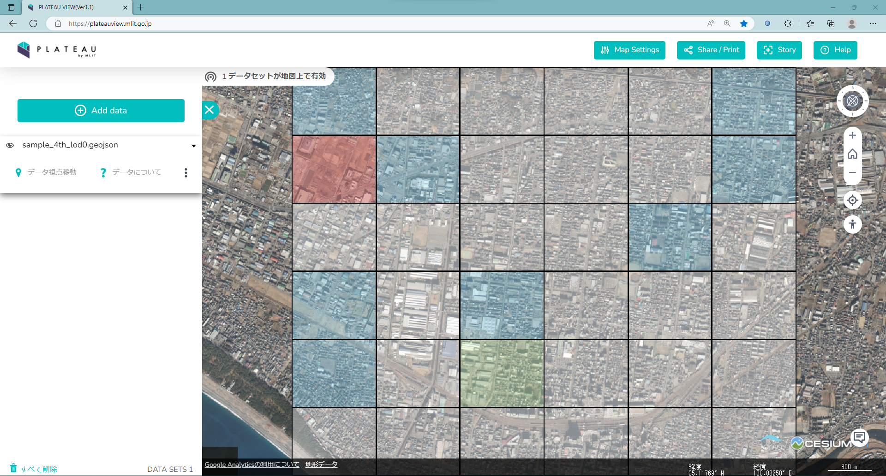
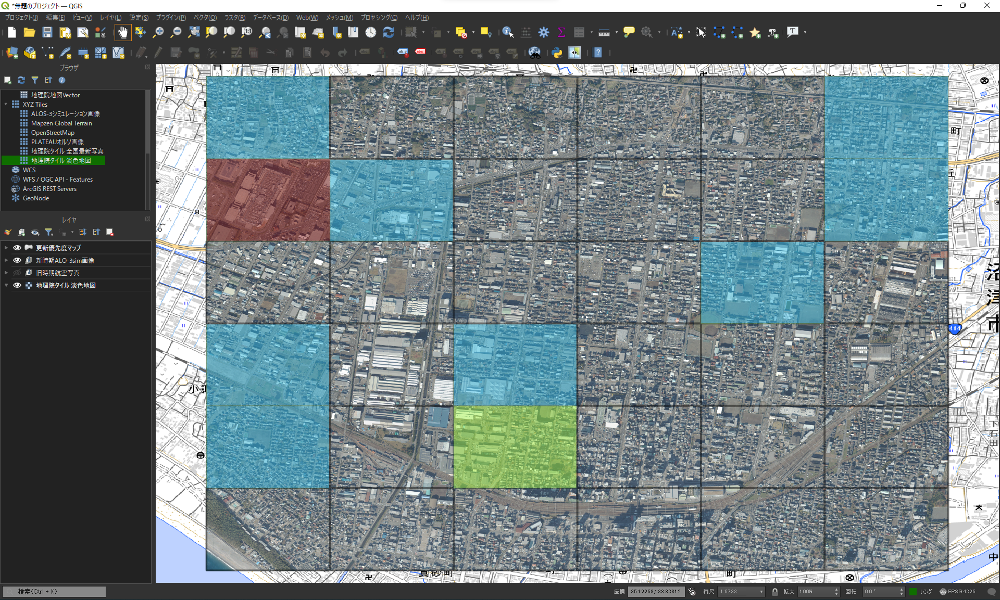

# 更新優先度マップの表示

## 概要  
本ページでは、作成した更新優先度マップの表示を行います。    

## PLATEAU VIEWでの表示
作成した更新優先度マップのGeoJSONファイルを[PLATEAU VIEW](https://plateauview.mlit.go.jp/)にドラッグ&ドロップすることで表示されます。  

## GISでの表示
ダウンロードした旧時期航空写真や新時期ALOS-3衛星（シミュレーション）画像、更新優先度マップをGISに表示させることにより、実際に更新優先度が高いメッシュでどのくらい建築物の面積が変わっているかなどを確認することができます。  
なお、GISで更新優先度マップを表示した場合は、[こちら](create_update_priority_map.md#step2-更新優先度マップのスタイリング)で設定したスタイルは反映されません。  

# [更新優先度マップと旧時期航空写真を表示](#tab/oldview)

# [更新優先度マップと新時期ALOS-3衛星シミュレーション画像を表示](#tab/newview)

---
